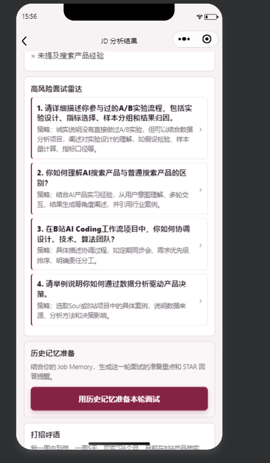
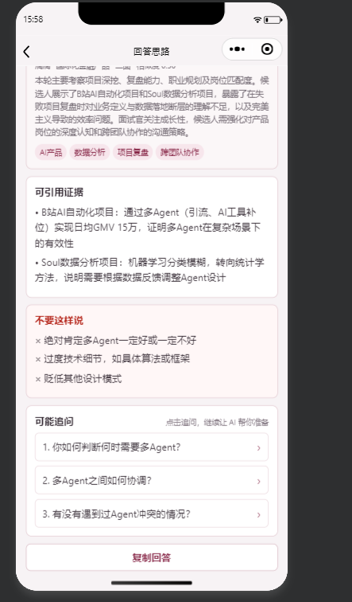

# AI Job Copilot

AI Job Copilot 是一个面向个人求职流程的 AI 面试 Copilot。它把 JD 分析、面试问答、面试复盘和 RAG 记忆检索串成闭环，让每一次面试复盘都能变成下一次面试准备的材料。

> 核心思路：AI 不替用户编经历，而是帮助用户整理、检索和复用自己的真实经历。

## 项目概览

| 项目 | 内容 |
| --- | --- |
| 产品类型 | AI 求职 / 面试 Copilot |
| 使用场景 | JD 分析、面试准备、回答生成、面试复盘、历史记忆复用 |
| 前端 | 微信小程序、H5 |
| 后端 | Node.js 原生 HTTP 服务 |
| AI 能力 | DeepSeek、Embedding、Supabase pgvector |
| 部署 | 腾讯云轻量应用服务器、PM2 |
| 访问控制 | 邀请码内测、多试用者 Job Memory 隔离 |

## 产品闭环

```text
投递前
  -> JD 分析
  -> 匹配分 / 风险点 / 高风险面试雷达

面试前
  -> 基于历史 Job Memory 准备本轮面试
  -> STAR 回答提醒 / 练习计划 / 一分钟 Pitch

面试中或面试前
  -> 问一问 AI
  -> 结合当前 JD 和历史记忆生成回答思路

面试后
  -> 粘贴复盘或 ASR 文本
  -> 结构化为 Job Memory
  -> 向量化存入 Supabase

下一次面试
  -> RAG 召回历史经验
  -> 生成更贴近个人经历的回答
```

## 核心功能

- **JD 分析**：解析岗位要求，输出岗位摘要、匹配分、匹配点、风险点、缺失能力和打招呼语。
- **高风险面试雷达**：从 JD 中预判可能被追问的问题，点击后可直接进入 AI 问答。
- **问一问 AI**：针对具体面试问题生成 30 秒短答、完整答法、可引用证据、避坑表达和可能追问。
- **Job Memory**：将面试复盘结构化为可检索的记忆卡片。
- **RAG 召回**：基于当前 JD 或面试问题召回相似历史复盘，辅助生成更贴近个人经历的回答。
- **历史记忆管理**：支持展开查看问题、卡点、下次策略、可复用证据，并删除重复记录。
- **邀请码内测**：通过轻量邀请码控制访问，并支持不同试用者的数据隔离。

## 截图位

截图文件放在 `assets/screenshots/` 下。建议补齐下面 5 张：

| 截图 | 建议文件名 | 展示重点 |
| --- | --- | --- |
| 首页 / 工作台 | `01-home.png` | 产品入口和主要功能 |
| JD 分析结果 | `02-jd-result.png` | 匹配分、风险点、高风险面试雷达 |
| 问一问 AI 结果 | `03-coach-result.png` | 回答思路、证据、可能追问 |
| 复盘生成 Job Memory | `04-review-memory.png` | 结构化复盘能力 |
| 历史记忆展开 | `05-history-detail.png` | RAG 记忆可见、可管理 |

截图补齐后，可以在这里放展示图：

```markdown


```

## 技术架构

```text
微信小程序 / H5
      |
      | x-app-token
      v
Node.js Backend
      |
      |-- DeepSeek: JD 分析、问答生成、复盘结构化
      |
      |-- Embedding API: 生成 query/card 向量
      |
      |-- Supabase Postgres + pgvector: 存储和召回 Job Memory
      |
      |-- PM2 + 腾讯云: 云端部署和常驻运行
```

## RAG 如何体现

这个项目里的 RAG 不是传统知识库问答，而是“个人面试记忆检索”。

1. 用户面试后粘贴复盘。
2. LLM 将复盘结构化为 Job Memory。
3. 后端提取问题、卡点、策略、证据等内容生成 embedding。
4. Job Memory 写入 Supabase pgvector。
5. 下一次 JD 分析或问一问 AI 时，后端根据当前问题生成 query embedding。
6. Supabase 召回相似历史复盘。
7. DeepSeek 基于当前问题和历史记忆生成回答。

业务价值是：每一次复盘都会进入下一次准备，而不是散落在聊天记录和文档里。

## 项目结构

```text
ai-job-copilot-showcase/
├── backend/       Node.js 后端、H5 页面、RAG/Job Memory 逻辑
├── miniprogram/   微信小程序端
└── assets/        作品集截图
```

## 文档入口

- [作品集 Case Study](./PORTFOLIO_CASE_STUDY.md)
- [项目说明文档](./backend/PROJECT_OVERVIEW.md)
- [需求文档](./backend/PRODUCT_REQUIREMENTS.md)
- [使用文档](./backend/USER_GUIDE.md)
- [Job Memory 说明](./backend/JOB_MEMORY.md)
- [GitHub 上传检查清单](./backend/GITHUB_UPLOAD_CHECKLIST.md)

## 后端启动

```bash
cd backend
npm install --omit=optional --no-audit --no-fund
npm start
```

完整 RAG 能力需要配置 `.env`。请复制 `backend/.env.example`，并在本地或服务器上填入真实环境变量。

注意：真实 `.env`、API Key、Supabase service role key、邀请码不要提交到 GitHub。

## 小程序配置

小程序接口地址位于：

```text
miniprogram/utils/api.js
```

公开仓库中使用的是占位地址。实际运行时需要改成自己的后端地址，例如：

```js
const API_BASE_URL = "https://your-domain.com";
```

微信小程序正式体验需要配置 HTTPS 域名和 request 合法域名。开发阶段可使用微信开发者工具的真机调试或“不校验合法域名”选项。

## 面试介绍版本

我做了一个面向个人求职流程的 AI Job Copilot。它不是单纯调用大模型接口，而是把 JD 分析、面试即时问答、面试复盘沉淀和 RAG 记忆检索串成闭环。投递前它会分析岗位匹配度和面试风险；面试前可以基于历史复盘生成准备方案；面试中遇到问题可以让 AI 结合 JD 和历史记忆生成回答思路；面试后复盘会被结构化成 Job Memory，并通过向量检索在下一次面试中复用。这个项目的重点是让 AI 基于用户的真实经历辅助表达，而不是编造经历。

